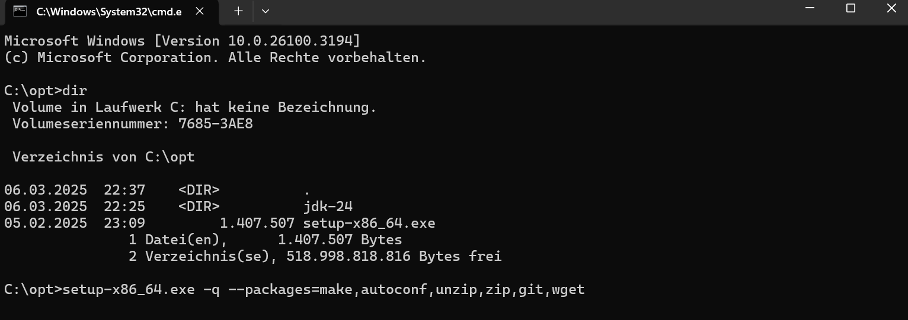
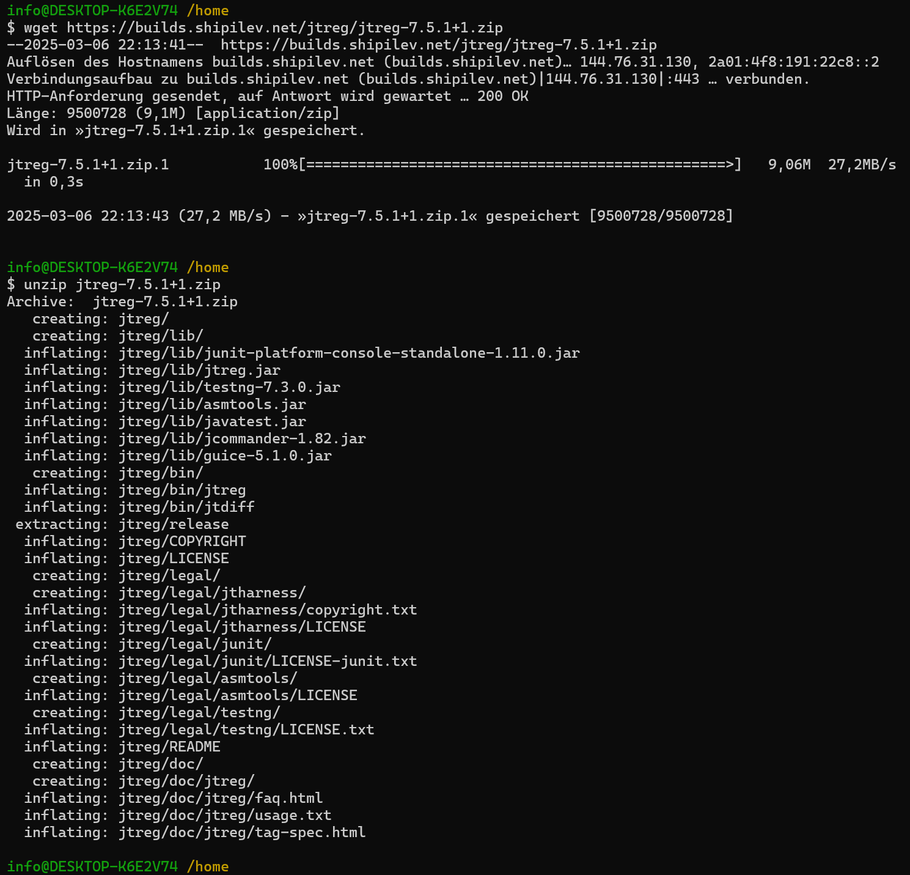
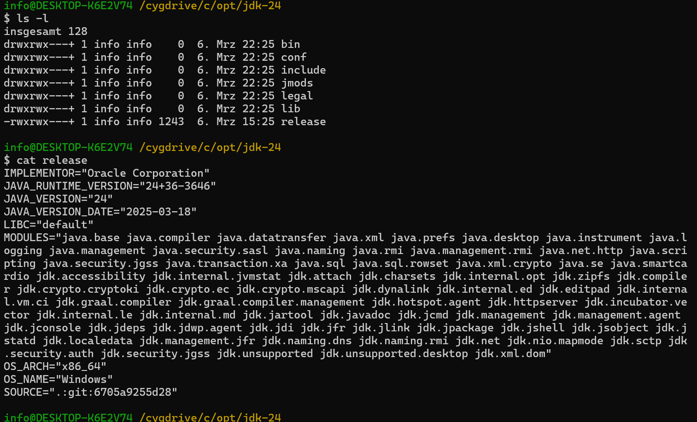
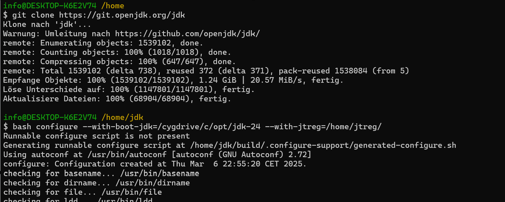
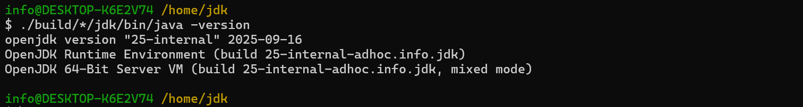

# Build OpenJDK on Windows 11

## Prerequisites
- Install Visual Studio
- Install Cygwin
- Additional Packages for Cygwin
- Latest JDK as long time release
- Jtreg for executing the tests

From Visual Studio Community Edition are only the Desktop development for C++ 
components are needed here. Important to install with the English Language Pack.
Out of support Components can be disabled by the installation Process.
Cygwin is needed for setup the make and configure components. The Binarys 
for OpenJDK is possible in this way to build in all Environments like Linux, MacOS and others.
Additional components like: make,autoconf,unzip,zip,git will be uses by the build
process.
Wget is used for unpack the Jtreg package.
If the Windows version from git will be used the following command have to be executed 
to avoid CR/LF issues:
- git config --global core.autocrlf false
 
One of latest releases of OpenJDK will be needed to generate all the java libraries.
Here in Example the Version 25 will be build, for this build are the valid versions: 23 ,24 and 25 to build.
With an older version then the following message will come up: "Your Boot JDK version must be one of: 23 24 25".
Jtreg is used to execute the test. Jtreg is similar to junit but at the beginning from java was junit not available.

### Install

#### Install [Visual Studio Community Edition](https://visualstudio.microsoft.com/de/vs/community/)
- Change Language Pack to English
- Disable: Out of support Components

#### Install [Cygwin](https://www.cygwin.com/install.html)
- in a Windows Terminal execute the folowing commands:
- install Cygwin environment:
1. Execute: ***setup-x86_64.exe***
2. Install additional Components:

#### Install [Jtreg](https://builds.shipilev.net/jtreg/) in Cygwin home direcory check for the latest version.
- Execute: ***wget https://builds.shipilev.net/jtreg/jtreg-7.5.1+1.zip***
- Execute: ***unzip jtreg-7.5.1+1.zip***

#### Download Install [boot JDK](https://jdk.java.net/) (select the Version: 24)
- Extract the package in directory: ***C:\opt\jdk-24***
 

The Build will proceed under Cygwin in home directory.
- execute in directory: ***C:\cygwin64*** the file: ***Cygwin.bat***
- go in home directory with the command: cd ..
- Execute: ***git clone https://git.openjdk.org/jdk*** this will clone the openjdk repository in ***/home/jdk*** directory.
- Go in directory: ***jdk*** 
- Execute: bash configure --with-boot-jdk=/cygdrive/c/opt/jdk-24 --with-jtreg=/home/jtreg/

- as next execute: ***make***
- as next check the result with ***./build/\*/jdk/bin/java*** -version

- optionally make the tier1 test as following: ***make run-test-tier1***
